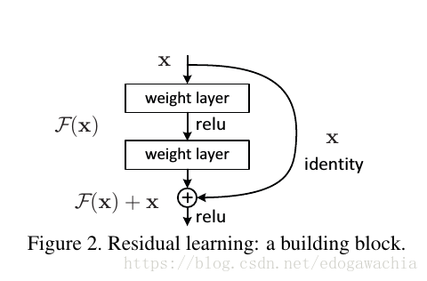

# Computer Vision Final Project

## 简介

本次大作业的内容是瓶盖检测，分辨出桌面上的瓶盖是正面、侧面还是反面。

达成的大作业要求：

* 基本要求：全部完成
  * 检测出正面的瓶盖
  * 检测出侧面的瓶盖
  * 检测出反面的瓶盖
  * 在简单背景上运行
  * UI
* 额外要求：
  * 使用颜色不一样的瓶盖
  * 使用不同形状的瓶盖

正确识别率达95%以上。

## 部署

用anaconda可以直接利用所给的env.yaml创建虚拟环境。

```bash
# env.yaml的name一栏里面存着虚拟环境的名字。若是助教电脑上名称重复了可以换一个名字。
conda env create -f env.yaml
# 激活创建的虚拟环境，cvProject为虚拟环境的名称。
conda activate cvProject

python demogui.py
```


## 基本算法及原理

对于一个输入的图片，首先要检测出哪些是瓶盖，然后再对于瓶盖的状态（正面、侧面、反面）进行识别。

### 瓶盖检测（提取）

瓶盖在图像中体现为一段连通区域。通过识别图像的连通区域，并进行过滤等操作去除噪声和杂物的影响，可以提取出瓶盖的位置坐标，并用瓶盖对应的矩形区域的对角线两点坐标来表示一个瓶盖。

#### 核心算法

本次实验先后使用了BFS和Two Pass两种算法来做瓶盖的检测，并比较了两种算法的性能。

* BFS算法：

  对图像上每一个点进行遍历，找出每一个点的邻接的连通点，并加入该点的连通组。这些连通组，每一个组代表了一个分立的连通区域，即一个组代表了一个瓶盖（的边缘)。这样就可以把瓶盖检测出来。

* Two Pass算法：

  上课老师讲过的算法，这里就简单描述大意。

  第一次遍历，需要遍历图片上的每一个点，并对有色区域打标签，并对冲突（即和同一个点邻接的不同标签的点）的不同标签点加入一个数组。

  第二遍遍历，将该数组里面所有冲突的点都列为同一标签。这样，具有相同标签的点即为连通区域。

以上为瓶盖检测的核心算法。

#### 误差消除及过滤

除核心算法之外，需要用一些附加的算法来做误差消除及过滤。

* 前置处理：首先将图像灰度化，并进行滤波等一系列操作消除噪声，并进行边缘检测。图像上剩下了瓶盖的边缘点（以及瓶盖的花纹的边缘点)

* 消除非瓶盖杂物对检测的影响（如图上的毛发）

  杂物（如毛发）占据的像素点很少。因此同样设置一个阈值，若是一个连通区域包含的像素点个数低于这个阈值，便认为这个连通区域不是瓶盖。

* 消除边缘检测对连通图检测的误差：

  边缘检测得到的同一个瓶盖的边缘，可能由于图像拍摄时光照等因素的影响并不连通。为了防止不连通的同一瓶盖边缘被认为是两个“瓶盖”，需要对上述的核心算法进行小修改

  * BFS

    在BFS搜索的时候，对每一个点不仅仅搜索其邻域的4或8个点，而是设置一个阈值，如15，那么对一个点则扫描其周围15 * 15范围内的所有点，并将这个范围认为是该点的“邻域”。这样就可以消除这样的误差

  * Two Pass

    原本设定两个点冲突需要两个不同标签的点出现在同一个点的邻域。在改进版里面，同样设置一个阈值，如15。那么简单来说，就是一个点的相邻15 * 15范围内的点都会被认为是该点的冲突点，在最后被打上同一标签。

通过以上算法，可以有效提取出一个图像中的瓶盖

#### 性能比较

经过测试，Two Pass的性能比BFS要更好。

### 瓶盖状态识别

将上面经过处理的图像（即标识了瓶盖位置的图像）提取出来，通过人工分类的方式，分成正面（front），侧面（side）和反面（back）三类，并通过机器学习的方式进行训练生成模型。最终能够做到，输入瓶盖的图片（由之前的算法裁剪好），再输入模型输出判断结果。

#### 模型训练

##### Resnet简介绍

我们选择了ResNet152的模型， ResNet152 是 CNN的一种模型，也是一种卷积神经网络，全称叫作Deep residual network. 在ResNet之前
卷积神经网络最多才十几层，VGG就代表了神经网络的深度，而Google的GoogleNet则往模型宽度研究。

从直觉上，神经网络的深度越深，效果应该越好，毕竟增加神经网络的深度，神经网络可以进行更加复杂的特征模式的提取。但是实践表明，传统
的神经网络在网络深度怎家到一定程度时会出现饱和的情况，loss不下降反而上升，深层的网络学习效果甚至比层数低的网络学习效果还差。出现这种情况的原因
可能是 `梯度爆炸/消失`， 而resnet的出现很好的解决了这个问题。
ResNet是何凯明教授在其论文中提出来的一种CNN的模型，摘得了CVPR2016最佳论文奖，在ImageNet比赛中摘得5项第一。


resnet网络结构由若干小的block组成，每个block的结构大致如下



输入X处，可以通过"短路"学习F(x) + x，即学习残差，而不是必须学习x到H(F(x))的映射。

##### 使用ResNet训练我们的数据集

1. 数据准备
如前所述，我们讲瓶盖图片输出后，人工进行分类，分成`back`, `front`, `side`三类，分别放在三个不同的文件夹，那么我们输入一个图片，神经网络的输出与我们的理想就可以进行很好的比较，从而降低这个学习误差，降低loss.
```python
image_datasets = {x: datasets.ImageFolder(os.path.join(config["data_root"], x),
                  data_transforms[x]) for x in ['train', 'val']}
```
我们使用了torchvision的`ImageFolder`方法进行dataset的建立，ImageFolder做的事情比较简单，主要就是实现`__getitem__`方法发牛一张图片及其`Label`，以方便在load data的时候可以很快地返回数据。<br/>

在建立Dataset的同时我们必须指定Transforms方法，即对数据的预处理，加载一张图片之后需要做的事情，添加这个方法的目的就是为了使得输入的维度保持一致，并且在训练的时候也增加随机性，而不是每次训练输入的顺序都一样。Transforms种有一个Normalize，是十分重要的，因为对于模型来说，输入的每个数据大小控制在[-1, 1]是比较合适的，而我们的图片的range是 [0, 255]，并且每个像素都是三维的列表，因此要归一化成一维的float。

2. 加载数据
加载数据是使用的`torch`的DataLoader类，这个类加载数据使用CPU，是个完全并发的操作，他会从`step 1`种建立的dataset提出成`bactch`打包以供模型训练使用。这里需要注意的就是因为`DataLoader`的是完全并发的，因此`dataset`的`__getitem__`不能出现写操作，因为load data的过程中没有锁保护。

3. 初始化模型
我们使用的是`resnet152`模型，为了减少错误和训练成本，我们使用了`torchvision`提供的`pretrained`的`resnet152()`方法得到其提供的预训练好调整过参数的模型。resnet152也是一种CNN, 也有 卷积层、池化层、全连接层。因为我们的问题是分类，将一个图片矩阵映射到一个3维向量，因此我们需要更改一下`pretrained的resnet152` 的全连接层，改为`Linear(in_features, 3)`。

4. 开始训练模型

数据准备工作都已完成，就可以开始训练模型，我们在配置文件中指定训练参数，比如`epochs`等等。在本次训练中我们使用24个回合，每个回合都分为两个阶段，`train`以及`eval`，如此做的目的是避免模型过拟合，在每次`train`的时候训练，更正模型的权重等参数，而`eval`则用来观测是否模型过拟合。<br/>
通过训练，我们发现模型对三类瓶盖拟合的比较好，每个回合训练的model在`eval`阶段都能达到较低的loss，最终loss会稳定在0.03左右，模型判断准确率也在98.77% - 99.5%之间，甚至会出现100%。<br/>
模型训练好之后就将其参数保存起来，以用于后续针对瓶盖进行分类判断。

5. 使用模型
在使用模型时，需要将已经训练的好的模型load到CPU或者GPU上，如果机器上由GPU可用，那么加载到GPU上，否则加载到CPU上，两者的差距不是很明显，因为数据维度实在太小了，知识224*224。<br/>
模型在使用时针对我们输入的完全没有测试过的100个瓶盖，判断准确率在95%以上(几乎是100%)。


TODO: